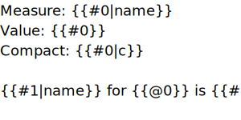
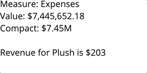
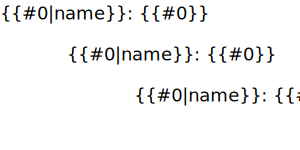
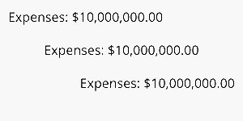

# SAS Visual Analytics Data-Driven Content Dynamic SVG

This project provides a SAS Visual Analytics (VA) data-driven content object that uses annotations on provided data and SVG file to create a dynamic illustration that responds to data updates.

## SVG Annotation Syntax

`{{`_`[NAME]`_`|`_`[OPT]`_`:`_`[VAL]`_`,…}}`

### Text

The text annotations allow control over the content and response to dynamic changes of text elements.

#### **Templating**

Templating annotations are used to dynamically modify the characters of the text and so are the only annotations that are included visibly within the SVG design.

<small>**SVG Source** (inspect to view annotated ids)</small> 

<small>**Result**</small> 

`{{`_`COLUMN`_`}}`  
These annotations must be placed within the text content of a `<text>` or `<tspan>` element. They are simplified from the standard syntax in that they are not allowed to be assigned a name. In place of of the name the annotation may simply contain a reference to the _`COLUMN`_ to insert the value from.

`{{`_`COLUMN`_`|c}}`  
Adding the `c` option to the annotation will result in the column's value being presented using the compact version of its format. This is ignored for non-numerics.

`{{`_`COLUMN`_`|name}}`  
Adding the `name` option to the annotation will result in the name of the column being inserted instead of its value. This is useful for cases where the dynamics are not set to specific columns and instead are provided by index position.

#### **Alignment**

The SVG format generated by many vector editors does not include text alignment. Therefore the desired alignment of the text must be provided via an annotation.

<small>**SVG Source** (inspect to view annotated ids)</small> 

<small>**Result**</small> 

`{{…,align/a:start/middle/end,…}}` 
The default alignment is start, which is to the left on LTR locales. The alignment works by taking the bounding box of the text before any changes are made to the text and using that to determine where the start, middle, or end is. Meaning that in the SVG file the initial left, middle, or right edge of the text element is used for the alignment.

### Transform

The transform annotations allow an object to have its position, rotation, and scaling be mapped to data dynamically. Multiple transforms can be used but can rapidly become complex.

While typically you would specify the transforms in a particular order in which they should be applied, this system has a fixed order for the transforms that avoids common pitfalls. That order is scale, rotate, and then position.

#### **Origin**

The origin annotation is used by both the scale and rotate transforms to determine how to apply the transform.

`{{…,origin/o:`_`X`_`;`_`Y`_`,…}}` 
The origin of all transforms is by default the upper left of the element's bounding box unless specified otherwise. This option allows the origin for transforms to be positioned anywhere within the element's bounding box. The _`X`_ and _`Y`_ value may be any number between `0.0` and `1.0` inclusive and represent the proportion from the element's upper left to bottom right corner at which to place the origin.

#### **Scale**

The scale annotations are used to change the size of elements dynamically based on numeric data values.

`{{…,scale/s:`_`COLUMN`_`,…}}` 
The scale transform scales the element in both the horizontal and vertical direction such that the element is at its initial size when _`COLUMN`_ is at its maximum value and is scaled to 0% when _`COLUMN`_ is at its minimum value.

`{{…,scaleX/sx:`_`COLUMN`_`,…}}` 
The scale x transform scales the element in only the horizontal direction such that the element is at its initial width when _`COLUMN`_ is at its maximum value and is scaled to 0% when _`COLUMN`_ is at its minimum value.

`{{…,scaleY/sy:`_`COLUMN`_`,…}}` 
The scale y transform scales the element in only the vertical direction such that the element is at its initial height when _`COLUMN`_ is at its maximum value and is scaled to 0% when _`COLUMN`_ is at its minimum value.

#### **Rotate**

The rotate annotations are used to change the rotational orientation of elements dynamically based on numeric data values.

`{{…,rotate/r:`_`COLUMN`_ `,…}}` 
The rotate transform rotates the element such that the element is at its initial rotation when _`COLUMN`_ is at its minimum value and is, by default, rotated 1 revolution clockwise when _`COLUMN`_ is at its maximum value.

`{{…,rotateRatio/rr:`_`RATIO`_`,…}}` 
The rotate ratio provides the amount of a single revolution for the rotation to occur within. A _`RATIO`_ of `0.5` would for example rotate the object from 0 to 180 degrees.

#### **Position**

The position annotations are used to change the onscreen position of elements dynamically based on numeric data values.

`{{…,position/p:`_`COLUMN`_`,…}}` 
The position transform translates the element in both the horizontal and vertical direction based on the associated guide element such that the element is at its initial position when _`COLUMN`_ is at its minimum value and is translated to the end of the guide when _`COLUMN`_ is at its maximum value.

`{{…,positionX/px:`_`COLUMN`_`,…}}` 
The position x transform translates the element in only the horizontal direction based on the associated guide element such that the element is at its initial position when _`COLUMN`_ is at its minimum value and is translated to the end of the guide when _`COLUMN`_ is at its maximum value.

`{{…,positionY/py:`_`COLUMN`_`,…}}` 
The position y transform translates the element in only the vertical direction based on the associated guide element such that the element is at its initial position when _`COLUMN`_ is at its minimum value and is translated to the end of the guide when _`COLUMN`_ is at its maximum value.

`{{…,guide/g:`_`NAME`_`,…}}` 
The guide option is required for the position transform to function. The guide is specified by providing the _`NAME`_ which is assigned to an element via its id. For example, for `<rect id="My Rect {{Guide01}}"/>` the name of the element that should be used in the guide option is `Guide01`. Different elements are treated differently as guides. The default is to use the width and height of the bounding box of the element as the amount of the translation. A `<line>` element uses the offset from its start to it's end, meaning that it can be oriented in any direction while a `<rect>` when used as a guide will always result in a translate occurring to the right and down. More freeform elements like a `<path>` and `<polyline>` result in the translation happening along the path they represent.

## VA Data Annotation Syntax
