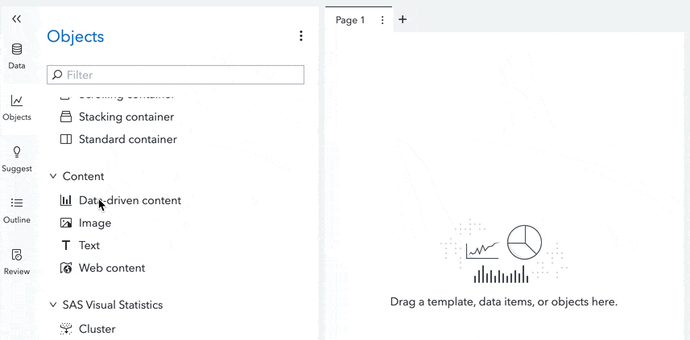
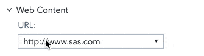
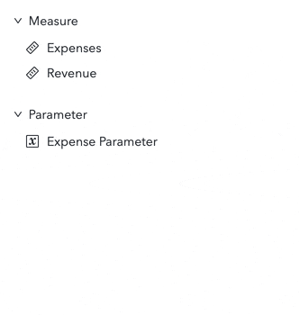
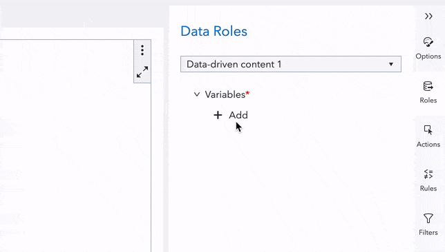

# SAS Visual Analytics Data-Driven Content Dynamic SVG

This project provides a SAS Visual Analytics (VA) data-driven content object that uses annotations on provided data and SVG file to create a dynamic illustration that responds to data updates. It is a wrapper around the [Dyanmic Vector Graphics](https://github.com/jrbenson/dynamic-vector-graphics#readme) project.

## Quick Start Guide

To use this system in a Visual Analytics report you must use a Data-driven content object.

<sub><sup>**Adding a Data-driven Content Object**</sup></sub><br/>


Then you must provide a URL to the VA Data-driven Content object's "URL" option. This URL should point to a copy of the `index.html` file in this project. This `index.html` page uses URL parameter syntax for an `svg` parameter which in turn provides a URL to the desired SVG file. This sample URL uses a test SVG to demonstrate:

```
https://jrbenson.github.io/sas-visualanalytics-dvg/?svg=https://jrbenson.github.io/dvg-gallery/svg/test/airplane-top.svg
```

If you host a copy of the library alongside your SVGs then the path can be relative:

```
https://my.host.com/dvg/dvg.html?svg=graphic.svg
```

If you cannot host your own copy of the page then either unpkg or GitHub pages host the `index.html` page as well:

- `https://unpkg.com/sas-visualanalytics-dvg/index.html`
- `https://jrbenson.github.io/sas-visualanalytics-dvg/`

<sub><sup>**Setting URL of VA Data-driven Content**</sup></sub><br/>


Any measures in the data that will be used to dynamically alter the SVG need to be annotated with their minimum to maximum data range.

<sub><sup>**Adding Range Annotation to Data**</sup></sub><br/>


And finally the data must be assigned to the "Variables" role of the Data-driven content object.

<sub><sup>**Adding Range Annotation to Data**</sup></sub><br/>


## Annotating an SVG File

To make your an SVG file dynamic it must be correctly annotated. Information on the annotation syntax may be found on the [Dyanmic Vector Graphics](https://github.com/jrbenson/dynamic-vector-graphics#readme) project.
